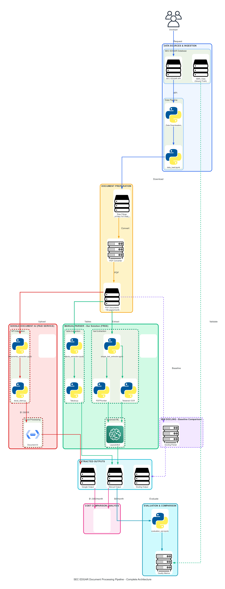

# 📄 PDF Parser

**A comprehensive PDF parsing system for extracting structured data from complex financial documents, particularly SEC filings (10-K, 10-Q, etc.).**

This project provides **multi-engine parsing, unified APIs, and quality assessment mechanisms** to process financial documents at scale with high accuracy and reproducibility.

 **GitHub Repo:** [Big-Data-Team-3/pdf-parser](https://github.com/Big-Data-Team-3/pdf-parser.git)
 
- **Interactive Tutorial**: [Google Codelabs - PDF Parser Guide](https://codelabs-preview.appspot.com/?file_id=1aaI--RF5ID99gkCwUVNLQulwxTSsljwvhOqxbY8q3V8#0)

- **Recording Link** : [Video Recording](https://drive.google.com/drive/folders/1ovXMpd7xj6oKaeUFmPXziRpBvTstffFq?usp=drive_link)
---

## 🌟 Project Description

`pdf_parser` is built to handle the **unique challenges of SEC filings**: complex layouts, nested tables, multi-column text, and scanned documents.

It combines **multiple extraction engines** (rule-based + deep learning + OCR) to ensure reliability, integrates **quality assessment pipelines**, and outputs structured data in formats suitable for downstream analytics.

---

## 🧩 Core Features

1. **Text Extraction**

   * Extract clean text using [`pdfplumber`](https://github.com/jsvine/pdfplumber).
   * Preserve **word-level bounding boxes** for layout-aware models.
   * Fallback to **Tesseract OCR** when text extraction fails.

2. **Table Extraction**

   * Detect and parse tables with `pdfplumber` and `tabula`.
   * Preserve table structure & relationships.
   * Export to **CSV/JSON** with page provenance.

3. **Layout & Metadata Capture**

   * Column detection, reading order, and text density analysis.
   * Identify document sections, headings, and form fields.
   * Provenance tracking (URL, accession no., parsing timestamp).

4. **Multi-Engine Architecture**

   * **PDFPlumber** – primary text + tables.
   * **Tabula** – specialized table extraction.
   * **Google Document AI** – cloud-based advanced processing.
   * **Docling** – deep layout analysis & normalization.
   * **Tesseract OCR** – fallback for scanned docs.

5. **Quality Assessment Pipeline**

   * Text quality metrics: word/line counts, density.
   * Confidence scoring (0–100) with engine-specific bonuses.
   * Automatic fallback when quality threshold not met.

6. **Structured Data Outputs**

   * JSON / JSONL – structured storage.
   * CSV – tabular data.
   * Markdown – human-readable summaries.
   * TXT – raw extraction.

---

## ⚡ Problem Statement

### **Core Challenges**

* Complex multi-column layouts in SEC filings.
* Need for **multi-modal extraction** (text, tables, forms).
* Maintaining **table structure** across formats.
* Handling poor-quality scans & mixed content types.
* Output flexibility (JSON, TXT, Markdown).

### **Technical Challenges**

* Layout complexity (multi-column, embedded tables, varying fonts).
* OCR fallback for non-text PDFs.
* Scalability for batch document processing.
* Quality assurance across multiple engines.

---

## ✅ Proof of Concept

### 1. Multi-Engine Parsing

* Combines **pdfplumber, tabula, docling, Google Document AI, and Tesseract**.
* Automatic selection of engine based on quality scoring.

### 2. Quality Assessment

* Text density & character distribution checks.
* Confidence scoring for each parsed output.
* OCR fallback when primary methods fail.

### 3. Structured Extraction

* Word-level positioning with bounding boxes.
* Preserved table formatting and relationships.
* Key-value form extraction for structured fields.

---

## 🛠️ Technology Stack

### **Primary Layout Understanding**

* **LayoutLMv3** – multimodal transformer for document understanding.
* **LayoutParser** – deep learning layout detection.
* **Docling** – modern document processing.

### **PDF Processing Libraries**

* pdfplumber – text & table extraction.
* tabula – table extraction (Java backend).
* Tesseract – OCR fallback.

### **Version Control & Orchestration**

* **DVC** – pipeline orchestration & metrics.
* **Git + Git-LFS** – versioning & large file storage.

### **Data Formats**

* JSON/JSONL – structured storage.
* CSV – tabular data.
* Markdown – human-readable output.

### **Commercial OCR / Document AI**

* **Google Document AI** – advanced document processing.

---

## 🏗️ Architecture

### **Pipeline Flow**

1. **Ingestion** → Download filings (PDF, XBRL) → `data/raw/`.
2. **Preparation** → Convert raw filings into PDFs.
3. **Parsing** → Extract text, tables, and metadata using multiple engines.
4. **Storage** → Save structured outputs (JSON, CSV, Markdown).
5. **Evaluation** → Run quality metrics, cost comparisons, and regression tests.

### **System Architecture**


*SEC EDGAR Document Processing Pipeline – Complete Architecture*


## 🚀 Getting Started

### **Prerequisites**

* Python 3.9+
* [Tesseract OCR](https://tesseract-ocr.github.io/) installed
* Java (for Tabula)
* (Optional) GCP for Document AI integration

### **Clone & Setup**

```bash
# Clone repository
git clone https://github.com/Big-Data-Team-3/pdf-parser.git
cd pdf-parser

# Create virtual environment
python3 -m venv .venv
source .venv/bin/activate

# Install dependencies
pip install -r requirements.txt
```

### **Run Example**

```bash
# Parse a single PDF
python notebooks/extract_table.py \
    --pdf data/raw/MSFT/10-K/PDFs/MSFT_10-K_20220728.pdf \
    --outdir output_tables
```

---

## 📂 Project Structure

```
pdf_parser/
├── docs/                # architecture+schema
├── data/
│   ├── raw/             # Raw PDFs + XBRL
│   ├── parsed/          # Parsed text, tables, metadata
├── notebooks/           # Jupyter notebooks for experiments
├── src/                 # Core parsing modules
├── tests/               # Unit & regression tests
└── dvc.yml              # Version orchestration
```

---

## 🔗 References

* [SEC EDGAR Filings](https://www.sec.gov/edgar.shtml)
* [pdfplumber](https://github.com/jsvine/pdfplumber)
* [Tabula](https://tabula.technology/)
* [DVC](https://dvc.org/)
* [Google Document AI](https://cloud.google.com/document-ai)

---

